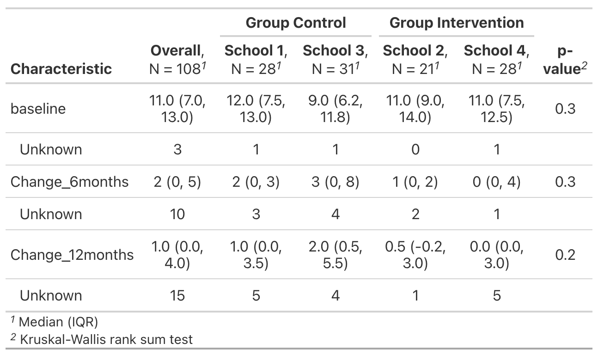

```{r setup, include=FALSE}
knitr::opts_chunk$set(echo = TRUE)

library(readxl)
library(tidyverse)
library(gtsummary)
library(mice)
library(lme4)
library("lmerTest")
library(broom.mixed)

df = read_excel("Proj 4 data.xlsx") %>%
  janitor::clean_names() %>%
  mutate(
    group = factor(group),
    time_int = case_when(
      time == 1 ~ "baseline",
      time == 2 ~ "6-month",
      time == 3 ~ "12-month"
    ),
    time_int = factor(time_int, levels = c("baseline", "6-month","12-month")),
    school = factor(school)
  ) %>%
  separate(id, c("id", "one"), sep="_") %>%
  select(-one) %>%
  mutate(id = as.numeric(id))

```


# Background

Our interest is in persistent asthma in minority children. 

* Comprehensive school-based interventions in collaboration with communities to reduce asthma morbidity and promote physical activity in urban areas.

* A pilot cluster RCT was conducted exploring this intervention in Bronx elementary schools
  - **Goal:** whether Children in schools receiving Asthma-PASS intervention may experience a greater improvement in the number of SFD at 6 **or** 12 months follow up than the children in the comparison group. 
  - 4 Bronx elementary schools were recruited into the pilot study. 
  - A total of 108 children recruited including ages 4-11 years with physician-diagnosed persistent or uncontrolled asthma attending kindergarten to 5th grades 


# Overview 

1. Data Overview 
2. Exploration into Pilot Study data

  - Model Specifications
  - Results 
  
3. Phase III Proposal

  - Model Specifications
  - Sample Size Suggestions
  

# Data Overview 

```{r echo=FALSE, message=FALSE, warning=FALSE}
variable_info <- tibble(
  Variable = c("ID","Time", "Group", "SFD", "School"),
  Definition =c(
    "Participant's ID",
    "Follow up time (Baseline, 6 months, 12 months)",
    "Intervention group (control or Intervention)",
    "Symptom free days in the past two weeks",
    "School recruited for the study"
  )
)

variable_info %>% knitr::kable()
```

\centering 
*Table 1:* Data Descriptions of Pilot Study


# Data Exploration 

```{r echo=FALSE, fig.height=6, message=FALSE, warning=FALSE}
df %>%
  mutate(
    group = ifelse(group == 0 , "Control", "Intervention")
  )  %>%
  ggplot(aes(x=sfd, fill=group)) +
  geom_bar()+
  facet_grid(time_int~group) +
  labs(
    title = "Symptom free Asthma days by Group and Time ",
    x = "Symptom free days in the past two weeks",
    fill = "Group"
  )
```

# Data Exploration 

```{r echo=FALSE, fig.height=6, message=FALSE, warning=FALSE}
df %>% 
  ggplot(aes(x = time, y = sfd,color = group, group = id))+
  geom_line()+
  geom_point()+
  stat_summary(aes(group = school),
               geom = "line",
               fun.y = mean, color ="black")+
  facet_grid(.~school)
```


# Data Exploration 

**Current outcome:** SFD (Count data)

- Due to the skewed distribution towards higher values a poisson model will not fit our data well
- Outcome does not seem linear over the time observations. 

*Interested in the change from baseline to observation times.* 

**New outcome:** Change in SFD (Continuous Data)

- Transform the SFD by calculated: 
  * 6 month observation - baseline 
  * 12 month observation - baseline 
- Baseline with become covariate


# New Continous Outcome

```{r echo=FALSE, fig.height=6, message=FALSE, warning=FALSE}
data_change = df %>% 
  pivot_wider(id_cols = c(id, school,group),
              names_from = time,
              values_from = sfd,
              names_prefix = "time"
              ) %>% 
  mutate(m6_m0 = time2-time1,
         m12_m0 = time3-time1) %>% 
  pivot_longer(c(m6_m0, m12_m0),
               names_to = "compare",
               values_to = "sfd_change") %>% 
  mutate(compare = factor(compare, levels = c("m6_m0", "m12_m0")))

sum_dc = data_change %>% 
  group_by(compare, group) %>% 
  summarize(mean = mean(sfd_change, na.rm = T),
            median = median(sfd_change, na.rm = T)) %>% 
  mutate(
    compare = ifelse(compare == "m6_m0", "Month 6 - Baseline", "Month 12 - Baseline"),
    compare = factor(compare, levels = c("Month 6 - Baseline", "Month 12 - Baseline"))
  )

data_change %>% 
  mutate(
    compare = ifelse(compare == "m6_m0", "Month 6 - Baseline", "Month 12 - Baseline"),
    compare = factor(compare, levels = c("Month 6 - Baseline", "Month 12 - Baseline"))
  ) %>% 
  ggplot(aes(x = sfd_change, fill = group))+
  # geom_histogram()+
  geom_density(alpha = 0.5)+
  geom_vline(data = sum_dc, aes(xintercept = median,color = group))+
  facet_grid(compare~.) +
  labs(
    title = "Density of the Changing in SFD by Time and Group",
    x = "Change in SFD"
  )
```


# Exploring variation between school and within school 

```{r echo=FALSE, fig.height=6, message=FALSE, warning=FALSE}
data_change %>%
  mutate(
    compare = ifelse(compare == "m6_m0", "Month 6 - Baseline", "Month 12 - Baseline"),
    compare = factor(compare, levels = c("Month 6 - Baseline", "Month 12 - Baseline")),
    group = ifelse(group == 0 , "Control", "Intervention"),
    school = case_when(
      school == 1 ~ "School 1",
      school == 2 ~ "School 2",
      school == 3 ~ "School 3",
      school == 4 ~ "School 4",
    )
  ) %>% 
  ggplot(aes(x=school, y=sfd_change, color = group)) +
  geom_boxplot()+
  facet_grid(.~compare) +
  labs(
    title = "Changing in SFD by Time, Group and School",
    y = "Change in SFD",
    x = "School",
    color = "Group"
  )
```

# Data Description 




# Missing Data

```{r echo=FALSE, fig.height=4, message=FALSE, warning=FALSE, fig.align='center'}
 df %>%
  select(-time_int) %>% 
  pivot_wider(
    names_from = time,
    names_prefix = "obs",
    values_from = sfd 
  ) %>% 
  mutate(
    `Month 6 - Baseline` = obs2 - obs1,
    `Month 12 - Baseline` = obs3- obs1
  ) %>% 
  rename(Baseline = obs1) %>% 
  select(-c(obs2, obs3)) %>% 
  mutate(
    school = case_when(
      school == 1 ~ "School 1",
      school == 2 ~ "School 2",
      school == 3 ~ "School 3",
      school == 4 ~ "School 4",
    ),
    school = factor( school, levels = c("School 1", "School 3", "School 2", "School 4"))
  ) %>% 
  select(-c(group,id, school)) %>%
  md.pattern(rotate.names = TRUE)
```

# Model Specifications

To model change in SFD let $i$ for school, $j$ for subjects, $k$ for measures. 

We will used mixed effect model. 

\begin{align*}
Y_{ijk} &= \beta_0 + \beta_1 Baseline_{ij} \\
&+ \beta_2 Group_{ij} + \beta_3 Compare_{ijk} \\
& + \beta_4 Group_{ij}\times Compare_{ijk} \\
&+ \alpha_{0i} + \alpha_{0j} + \epsilon_{ijk} 
\end{align*}

where $\alpha_{0i} \sim N(0, \sigma^2_1)$,  $\alpha_{0j} \sim N(0, \sigma^2_2)$,  and $\epsilon_{ijk} \sim N(0, \sigma^2)$. 

We will be assuming data is missing at random (MAR)$^{[1]}$. 


# Model Result Fixed

\begin{columns}
  \begin{column}{0.45\textwidth}
    \textbf{Fixed Effects Estimates:}
    \centering 
    \includegraphics{mod1_est.png}
  \end{column}
  \begin{column}{0.54\textwidth}
  \centering 
    \textbf{Model Interpretations:}
    \begin{enumerate}
      \item  When comparing the 6 months and baseline, The increase of sfd in intervention group is 1.1 (-0.46, 2.6) more than the increase of sfd in the treatment group.
      \item  When comparing the 12 months and baseline, The increase of sfd in intervention group is 0.81 (-1.60, 2.12) more than the increase of sfd in the treatment group.
      \item  No significant improvement from intervention group. 
    \end{enumerate}
  \end{column}
\end{columns}


# Model Result Random 

\begin{columns}
  \begin{column}{0.48\textwidth}
     \textbf{Model 1 Random Effects:}
    \includegraphics{mod1_random_est.png} 
  \end{column}
  \begin{column}{0.48\textwidth}
  Calculating the Intraclass Correlation Coefficient
    \begin{enumerate}
    \item $\rho = \frac{\sigma_2^2}{\sigma_2^2+\sigma^2} = \frac{0}{0+10.560} = 0$
    \end{enumerate}
  \end{column}
\end{columns}


# Model Quality 

```{r echo=FALSE, out.width="48%",message=FALSE, warning=FALSE}
data_change = data_change %>% 
  rename(baseline = time1)
mod1 <- lmer(sfd_change ~ baseline + group + compare + group*compare + 
               (1|school) + (1|id), 
             data = data_change)

plot(mod1, main="Residual plot") #Residual plot of mm for lmer object

qqnorm(residuals(mod1))
qqline(resid(mod1))
```


# Cluster RCT design

*	The investigators wish to propose a **cluster-randomized clinical trial (RCT)** in 30 Bronx schools to evaluate the effectiveness of their intervention program. 

* Primary hypothesis: compared to the control group, children in schools randomized to intervention group will experience a greater improvement in the number of SFD at **any of the 3, 6, 9, and 12 months** assessment. 

* The investigators would like to have at **80% probability** to declare the trial is successful if the true effect size in **improvement of SFD over time** is **at least 1/3 standard deviation**. 

# Study design proposal:

* The primary interest of the study:  test whether there is difference at any of the 3,6,9,12 months;
* Consider 4 comparisons separately:
  * month3: sfd_chage~group
  * month6: sfd_chage~group
  * month9: sfd_chage~group
  * month12: sfd_chage~group
  
**Two levels of Sampling**

- $N_1$: Number of Individuals in each School *(What we want to estimate)*
- $N_2$: Number of Schools for one treatment arm (15 in our case)


# Study design proposal:

**2 level structure**$^{[2]}$:

$$
y_{ij} = \beta_0+\beta_1X_{ij}+\beta_2y_{0,ij}+u_i+\epsilon_{ij}
$$


* i for school, j for subject, $y_{ij}$ is the sfd_change from tested time point to baseline
* within each comparison, there is only 1 measurement. So no consideration of the intra-subject correlation
* $u_i\sim N(0, \sigma_2^2)$, random intercept between schools
* $\epsilon_{ij}\sim N(0,\sigma_e^2)$, random error term 

**Intraclass Correlation Coefficient**


$$
\rho = \frac{\sigma^2_2}{\sigma^2_2 + \sigma^2_e}
$$

# Hypothesis Set Up

**Hypothesis:**$H_0:\beta_1=0, H_1:\beta_1\neq0$

* calculate N based on normal distribution, with multiple adjustment: $\alpha^* = \alpha/4 = 0.025/4$
* $\beta = 0.2$
* $N_1=N_0=15$
* Interested in when standardized effect size $\Delta = 1/3$


# Sample Size Calculation 

**Test statistics**

$$
D_{2}=\frac{\sqrt{N_{2} N_{1}}\left(\bar{Y}_{1}-\bar{Y}_{0}\right)}{\sigma \sqrt{2 (1-\rho)}} \sim N(0,1)
$$

**Sample Size formula**

$$
N_{1}=\frac{2(1-\rho) z_{\alpha^*, \phi}^{2}}{N_{2} \Delta_{(2)}^{2}-2 \rho z_{\alpha^*, \phi}^{2}}
$$
Where $z$ is calculated based on the normal distribution.

$$
z_{\alpha^*, \beta}^2 = (z_{\alpha^*/2}+z_{\beta})^2 = \left[\Phi^{-1}(1-\alpha^*/2)+\Phi^{-1}(1-\beta)^{-1}\right]^2
$$


# Sample Size Suggested 

```{r echo=FALSE, message=FALSE, warning=FALSE}
load("samp_est.RData")

samp_est %>%
  knitr::kable()
```

  

# Resources 

[1] Hogan, J. W., Roy, J., & Korkontzelou, C. (2004). Handling drop-out in longitudinal studies. Statistics in Medicine, 23(9), 1455–1497. https://doi.org/10.1002/sim.1728

[2] Ahn, C., Heo, M., & Zhang, S. (2014). Sample size calculations for clustered and longitudinal outcomes in clinical research. CRC Press.

<!--
# temp
* barplot at each time point -- verify poisson might be less reasonable
* barplot for 6 v.s. baseline and 12 v.s. baseline -- see distribution to verify normal trend -- middle high, 2 tail low
  * equal variance plot -- see if the control/trt group have roughly equan variance to decide 2 sample t test with equal/unequal var (continous) 
* sphagetti plot to disprove the linear trend
* Box/point plot for intra-class correlation visualization, facet by month. (https://dcricollab.dcri.duke.edu/sites/NIHKR/KR/Intraclass_Correlation_Coefficient_Cheat_Sheet_March_15_2020.pdf)

# Analysis for the pilot study
* Paired proportion test (binomial) / Paired T test (continuous, normal) 
* For 6 months v.s. baseline, compair pass v.s. control
* For 12 months v.s. baseline, compair pass v.s. control
* Multiple adjustment
* Describe and comment on the effect sizes.
* Estimate intra class variation

* with bonferroni adjustment: $\alpha^* = \alpha/4$ for the 4 comparison -->

